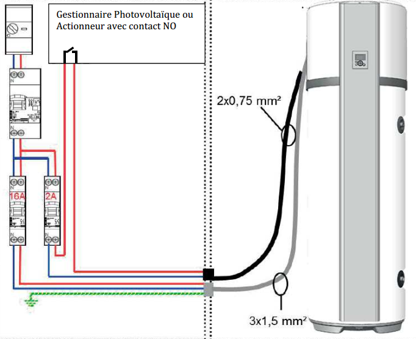
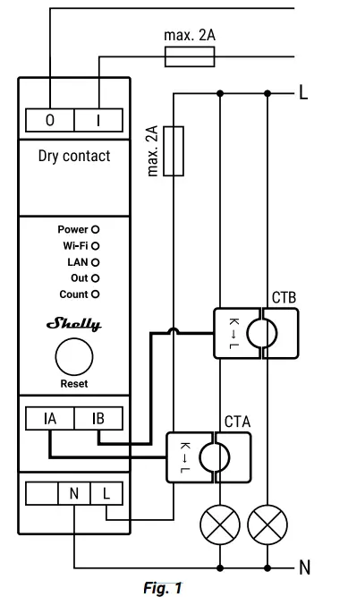

# PV router for Aeromax water heater

Photovoltaic Connection with Aeromax 5

When you combine a photovoltaic system with an Aeromax 5, you can use any extra solar power to heat water for your home. This is done by storing the excess electricity in a thermodynamic water heater.
To make this happen, the inverter (the device that converts solar power into usable electricity) needs a special feature. This feature allows it to send a signal to the water heater, telling it to start heating. This signal is a standard 230V-50Hz electrical signal.
It's important to note that the water heater itself still needs a constant power supply to operate. The extra signal from the inverter simply tells the heater when to use the solar power.

When the PV signal is present, the heater will go up to max temperature (62°C).

Note : once the signal is received, the heater will run minimum for 30min: I guess this is to avoid too many on/off cycles in a day.
Due to this delay, we may need to consider high trigger threshold, so we have some margin in case of cloud etc..

To build this special feature, we can use a Shelly Pro em 50 module with an appropriate script.

# Setup

> [!CAUTION]
> **🚨Working with mains electricity can be dangerous. Always consult with a qualified electrician before attempting any electrical work.🚨**

1/ Set your Aeromax in photovoltaic mode (see manual). it shall look like this : 

in the script :
IA / em0 probe is used for main consumption (clamp around the L wire out of your provider meter)
IB / em1 probe is used on the heater L wire (not requested for the script, you may use it for something else).

2/ Install your Shelly pro (see manuel). 

You can consider using the Shelly dry conact to replace the "Gestionnaire Photovoltaique" in the previous diagram.

**🚨Don't forget the 2A protections!🚨**

3/ use Shelly pro module to provide the 230V signal requested by the Aeromax to detect we have extra solar power to use.

# The script

Follow shelly manuel for setup (wifi etc...).

Once it's done, you may use the script by going to http://<your_shelly_ip>/#/scripts, add a script.

If you use "tempo" from EDF (french provider), you may use script_tempo.js to take more margin on 'red' days  (tempo color need to be provided by MQTT)

